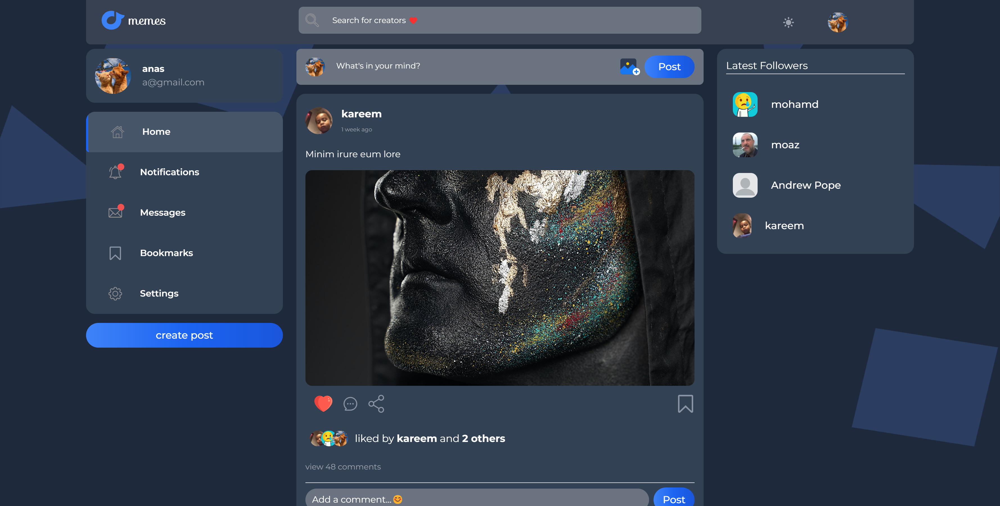
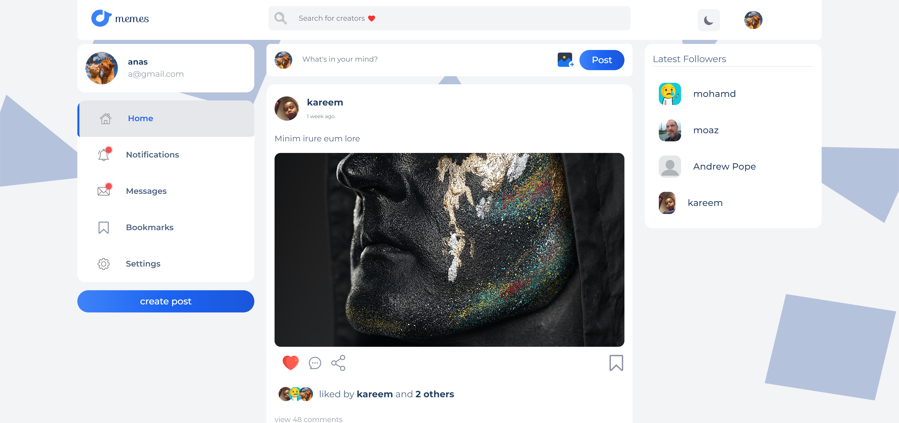
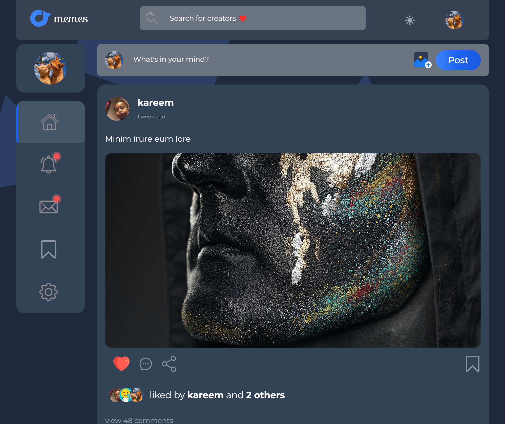
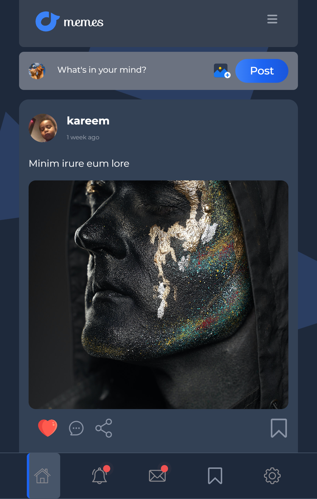
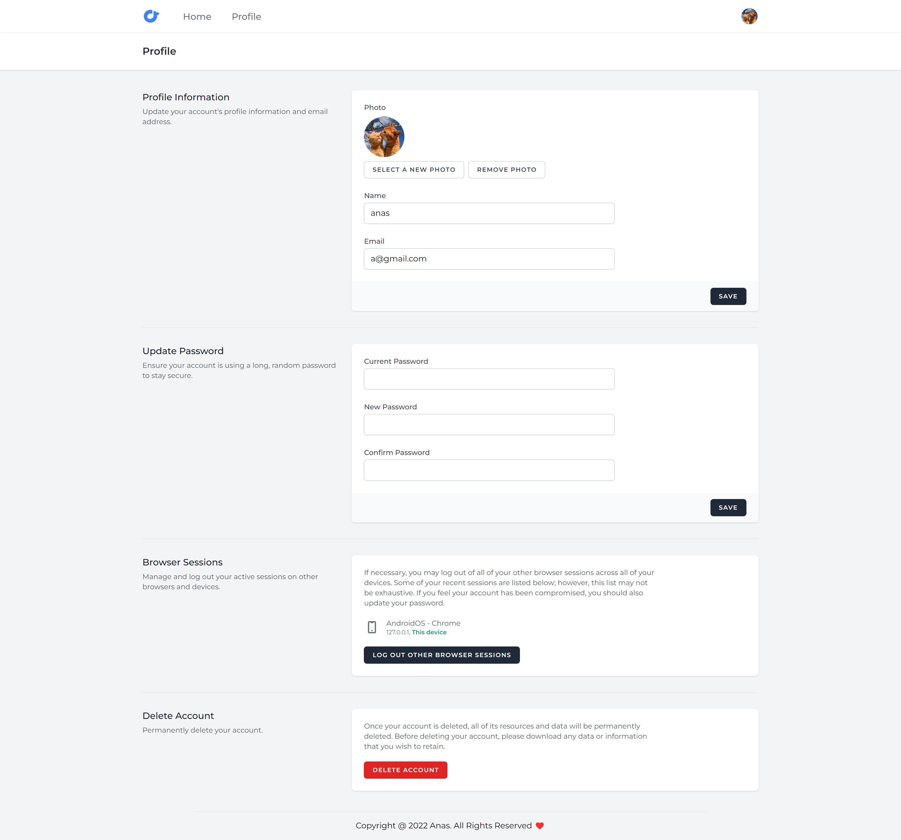
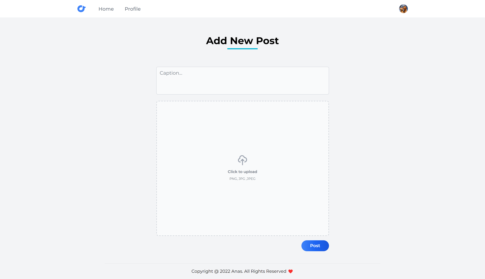
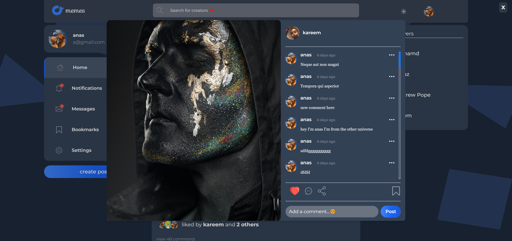

## Project Overview

This is a social media web application project and I choose to use jetstream in this project as a starter kit along with inertia.js just for practice purposes.


# Hi, I'm Anas! 👋
I'm a full-stack web developer passionate about
creating interactive applications and experiences on
the web.


## Start the project 

follow the instructions below to start this project
after cloning my project and changing the directory inside the project itself...


install dependencies
```bash
  npm install
```

build the project
```bash
  npm run build
```
### generate a database with whatever name you want but make sure to edit the `.env` file with this name 

migrate the database 
```bash
  php artisan migrate
```

start the server 
```bash
  php artisan serve
```
    
## Some Features

- Light/dark mode toggle
- Full responsive screen (pc, tablet, mobile)
- Placeholder loading page before the page is fully loaded
- Login/Register
- Settings page to control profile settings
- Security layer over dangerous operations like deleting and updating posts
- Ability to add new posts 
- Used pagination to split the posts into several pages
- Used Cache to cache heavy operations to avoid bad performance
- Ability to delete or modify any owned post
- Follow and Unfollow system Auto-generate a basic profile once the user signed in  
- Ability to like the posts and share comments or even share the post link without reloading the page 
- Ability to add posts as BookMarks without reloading the page 
- Ability to search for users without reloading the page 
- Auto-sending welcome Mail to newly registered users 


## Some screenshots of my project

**Desktop dark view**



**Desktop light view**



**Tablet view**



**Mobile view**




**Profile of other users**


**Profile of authenticated user**


**Profile settings**



**Create post view**



**comments view**



**comments view**


## 🛠 Skills
HTML, CSS, tailwindcss, JavaScript, JQuery, Vue.js, Inertia.js, PHP, Laravel, MYSQL.... 


## 🔗 Links


[](https://www.linkedin.com/in/anas-elnahef-10074021b/)


